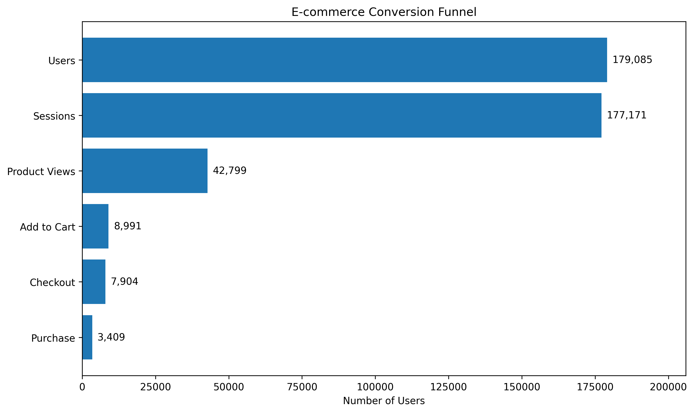
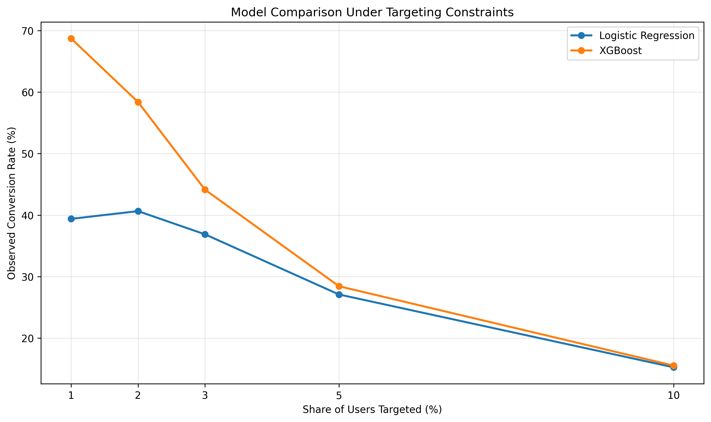
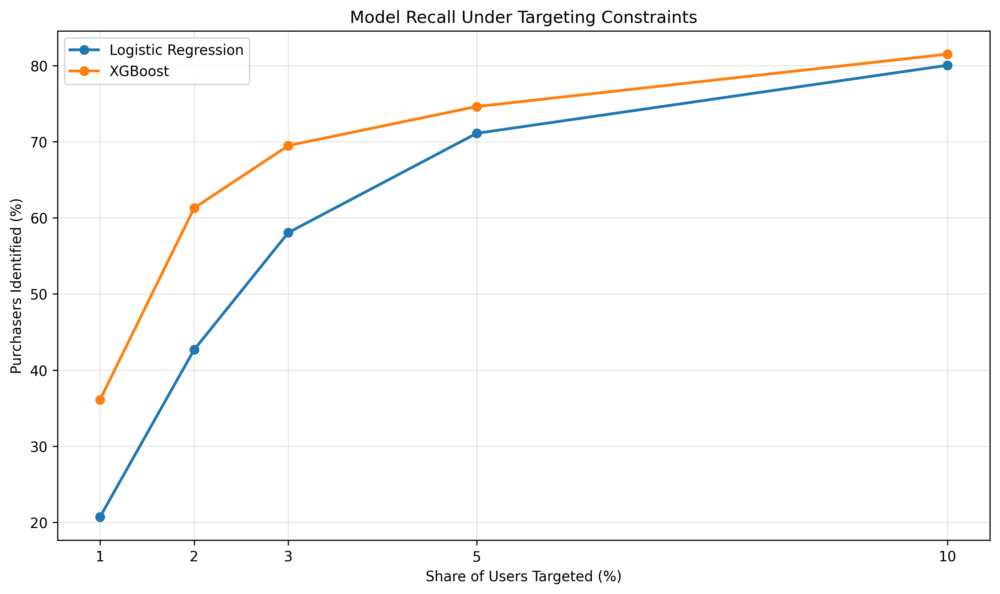
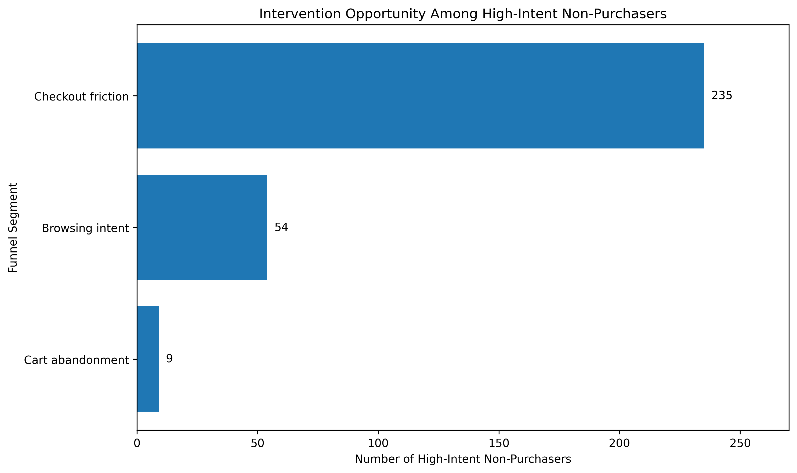

# Product Engagement & Conversion Analytics

An end-to-end Product Data Science project analyzing e-commerce user behavior to identify conversion opportunities, predict purchase intent, prioritize high-value users, and design a data-driven experimentation strategy.

## Overview

Product teams often face a practical question:

> **Which users should we target, what intervention should we use, and how can we measure whether it actually improves conversion?**

This project builds an end-to-end framework to answer that question using Google Analytics 4 e-commerce event data.

The analysis combines:

* Conversion funnel analysis
* Early engagement and behavioral analysis
* Predictive modeling
* Capacity-constrained user targeting
* Behavioral intervention segmentation
* A/B experiment design
* Experiment power planning
* Business impact scenarios

The key product principle is:

> **The model predicts who to target; the randomized experiment determines whether the intervention works.**

---

## Key Results

| Metric                                 |        Result |
| -------------------------------------- | ------------: |
| Users analyzed                         |       179,085 |
| Purchasers                             |         3,409 |
| Overall conversion rate                |     **1.90%** |
| XGBoost ROC-AUC                        |     **0.928** |
| XGBoost PR-AUC                         |     **0.527** |
| Top-2% targeting rate                  |     **2.00%** |
| Conversion among top-2% targeted users |    **58.38%** |
| Purchasers identified in top-2%        | **418 / 682** |
| Recall at top-2% targeting             |     **61.3%** |
| High-intent non-purchasers             |       **298** |
| Checkout-friction opportunity          | **235 users** |

---

## Business Problem

A low overall conversion rate does not mean all users have equal purchase intent.

The goal of this analysis is to determine:

1. Where users drop out of the conversion funnel
2. Which early behaviors are predictive of purchase
3. Whether purchase intent can be predicted within the first 24 hours
4. How to prioritize users when marketing/product intervention capacity is limited
5. What product interventions could address different behavioral segments
6. How to validate those interventions using randomized experimentation

---

## Dataset

The project uses the public **Google Analytics 4 Obfuscated Sample E-commerce Dataset** available in BigQuery.

**Source table:**

`bigquery-public-data.ga4_obfuscated_sample_ecommerce.events_*`

**Analysis period:**

November 1, 2020 – December 31, 2020

The raw event-level data contains user interactions such as:

* Session starts
* Product views
* Product searches
* Item selections
* Add-to-cart events
* Checkout events
* Purchases

Data preparation and feature engineering were performed in **Google BigQuery**, with modeling and analysis conducted in **Python/Google Colab**.

---

## Conversion Funnel

Across the analysis period:

* 179,085 users generated activity
* 177,171 reached a session start
* 42,799 viewed a product
* 8,991 added an item to their cart
* 7,904 reached checkout
* 3,409 completed a purchase

The resulting overall conversion rate was **1.90%**.



### Funnel Insights

The largest absolute user drop occurs between sessions and product views, while the lowest stage conversion rate occurs between product views and add-to-cart.

The checkout-to-purchase rate was approximately **43.1%**, suggesting that users reaching checkout represent a particularly valuable population for targeted product interventions.

---

## Early Engagement Analysis

To avoid using post-purchase behavior as a predictor, a separate feature set was created using only events occurring during each user's **first 24 hours**, before their first purchase.

Features included:

* `early_sessions`
* `early_product_views`
* `early_add_to_cart`
* `early_checkouts`
* `early_searches`
* `early_item_selections`

This creates a more realistic prediction setting where the model attempts to identify purchase intent early enough for a product intervention.

### Behavioral Findings

Purchase intent was strongly associated with deeper funnel engagement.

Compared with non-purchasers, purchasers demonstrated substantially higher levels of:

* Product views
* Add-to-cart activity
* Checkout activity
* Item selection
* Overall early engagement

Among the early behavioral features, **checkout activity showed the strongest relationship with purchase**, followed by product views and add-to-cart behavior.

These findings motivated the predictive modeling stage.

---

## Predictive Modeling

### Modeling Objective

Predict whether a user will eventually purchase using only their first 24 hours of behavioral activity.

Two models were evaluated:

1. Logistic Regression — interpretable baseline
2. XGBoost — nonlinear tree-based model

The dataset was split into:

* **60% training**
* **20% validation**
* **20% untouched test**

Stratification was used because purchasers represent a small fraction of users.

---

## Logistic Regression Baseline

Logistic regression provided an interpretable benchmark.

The model achieved:

* ROC-AUC: **0.919**
* PR-AUC: **0.359**

The strongest standardized predictor was early checkout activity.

Because the model uses standardized features, its odds ratios represent the association with purchase probability for approximately a one-standard-deviation increase in each feature, holding the other features constant.

These relationships should be interpreted as **predictive associations rather than causal effects**.

---

## XGBoost Model

XGBoost was evaluated to capture nonlinear relationships between early engagement behaviors.

Performance on the untouched test set:

* **ROC-AUC: 0.928**
* **PR-AUC: 0.527**

The substantially higher PR-AUC is particularly useful in this imbalanced classification problem because it evaluates performance on the positive purchasing class more directly.





---

## Capacity-Constrained Targeting

A key product analytics question is not simply:

> "How accurate is the model?"

Instead:

> **"If the product team can only target a small percentage of users, which model creates the best audience?"**

Both models were therefore evaluated at fixed targeting rates.

| Users Targeted | Logistic Conversion | XGBoost Conversion | Logistic Recall | XGBoost Recall |
| -------------: | ------------------: | -----------------: | --------------: | -------------: |
|         Top 1% |               39.4% |          **68.7%** |           20.7% |      **36.1%** |
|         Top 2% |               40.6% |          **58.4%** |           42.7% |      **61.3%** |
|         Top 3% |               36.9% |          **44.1%** |           58.1% |      **69.5%** |
|         Top 5% |               27.1% |          **28.4%** |           71.1% |      **74.6%** |
|        Top 10% |               15.2% |          **15.5%** |           80.1% |      **81.5%** |

At a **2% targeting capacity**, XGBoost identified:

* 716 users
* 418 purchasers
* 61.3% of all purchasers in the test set
* 58.38% observed conversion among targeted users

This demonstrates why evaluating a model under realistic operational constraints can be more useful than optimizing for a single classification metric.

---

## Final Targeting Audience

The final targeting policy selects the **top 2% of users ranked by predicted purchase probability**.

This represents a capacity-constrained product targeting strategy rather than an arbitrary probability threshold.

For the historical test example:

* Test users: 35,817
* Targeted users: 716
* Targeting rate: approximately 2%
* Observed targeted conversion: **58.38%**
* Purchasers identified: **418**
* Recall: **61.3%**

Importantly, this observed targeting lift should **not** be interpreted as a causal increase in conversion.

---

## Intervention Opportunity

Among the targeted users who did not purchase, 298 users were identified as high-intent non-purchasers.

These users were segmented based on their position in the behavioral funnel.

| Segment           |   Users | Share of Opportunity |
| ----------------- | ------: | -------------------: |
| Checkout friction |     235 |                78.9% |
| Browsing intent   |      54 |                18.1% |
| Cart abandonment  |       9 |                 3.0% |
| **Total**         | **298** |             **100%** |



### Why this matters

Rather than sending the same intervention to every predicted user, the analysis connects predicted intent with behavioral context.

This enables more targeted product strategies.

---

## Product Intervention Strategy

### 1. Checkout Friction

Users reached checkout but did not purchase.

Potential interventions:

* Simplify checkout flow
* Reduce unnecessary form fields
* Improve shipping-cost visibility
* Surface return policies earlier
* Reduce unexpected checkout friction

### 2. Cart Abandonment

Users added products to their cart but did not reach checkout.

Potential interventions:

* Cart recovery reminders
* Clear shipping and return information
* Checkout simplification
* Better visibility of cart contents

### 3. Browsing Intent

Users demonstrated substantial product interest but did not add items to their cart.

Potential interventions:

* Personalized recommendations
* Product comparisons
* Reviews and social proof
* Clearer pricing/value information
* Improved product detail pages

The objective is **not** to automatically discount every high-intent user.

Instead, the model identifies promising users while behavioral segmentation determines the appropriate product experience.

---

## Experimentation Framework

Prediction alone does not establish that an intervention will increase conversion.

The proposed next step is a randomized A/B experiment.

### Experiment Population

High-intent non-purchasers identified by the XGBoost targeting policy.

### Randomization

Eligible users are randomly assigned:

* **50% Control**
* **50% Treatment**

### Control

Existing product experience.

### Treatment

Behavior-specific intervention based on the user's funnel segment.

### Primary Metric

**Purchase conversion within 48 hours**

### Secondary Metrics

* Revenue per user
* Add-to-cart rate
* Checkout completion rate
* Engagement rate

### Guardrail Metrics

* Refund/cancellation rate
* Notification opt-out rate
* Negative engagement signals

### Decision Rule

Launch the intervention only if the treatment produces a statistically significant improvement in purchase conversion without materially worsening guardrail metrics.

---

## Experiment Power Planning

For illustrative planning purposes, assume:

* Baseline conversion: **10%**
* Target conversion: **13%**
* Relative improvement: **30%**
* Significance level: **α = 0.05**
* Statistical power: **80%**
* Allocation: **50/50**

The resulting planning estimate is approximately:

* **1,769 users per group**
* **3,538 total users**

This is an **experiment planning estimate**, not an observed result from the historical dataset.

In a production setting, the final sample size would depend on the actual eligible population, baseline conversion, minimum detectable effect, experiment duration, and business constraints.

---

## Business Impact Scenarios

The historical analysis identified **298 high-intent non-purchasers**.

If an experiment eventually demonstrated incremental conversion improvements of:

| Incremental Conversion | Additional Purchases |
| ---------------------: | -------------------: |
|                     5% |                  ~15 |
|                    10% |                  ~30 |
|                    15% |                  ~45 |
|                    20% |                  ~60 |

These are scenario estimates intended to illustrate potential business impact.

They are **not causal forecasts**.

---

## Key Product Insights

### 1. Conversion is concentrated among highly engaged users

A relatively small group of highly engaged users accounts for a disproportionate share of purchases.

This supports prioritizing high-intent audiences rather than treating every user equally.

### 2. Deeper funnel behavior is highly predictive

Early checkout and add-to-cart behavior provide strong signals of purchase intent.

### 3. Model evaluation should reflect product constraints

A model's usefulness depends not only on ROC-AUC but also on how effectively it performs when the product team can only target a limited percentage of users.

### 4. Different users require different interventions

Behavioral segmentation allows product teams to move from generic targeting toward context-aware interventions.

### 5. Prediction and causality are different problems

The model predicts who is likely to purchase.

A randomized experiment is required to determine whether an intervention actually causes incremental conversion.

---

## Technical Stack

**Data & Analytics**

* Google BigQuery
* SQL
* Python
* Pandas
* NumPy

**Machine Learning**

* Scikit-learn
* XGBoost
* Logistic Regression
* Feature scaling
* Classification evaluation
* Precision/Recall analysis

**Product Analytics**

* Funnel analysis
* Behavioral segmentation
* Capacity-constrained targeting
* Conversion analysis
* A/B testing
* Experiment power planning

**Visualization**

* Matplotlib

---

## Repository Structure

```text
product-engagement-conversion-analytics/
│
├── figures/
│   ├── conversion_funnel.png
│   ├── model_conversion_comparison.png
│   ├── model_recall_comparison.png
│   └── intervention_opportunity.png
│
├── sql/
│   ├── 01_user_purchase_features.sql
│   ├── 02_early_engagement_features.sql
│   └── 03_funnel_analysis.sql
│
├── README.md
└── .gitignore
```

---

## Limitations

Several limitations should be considered when interpreting the analysis:

* The dataset is an obfuscated public sample rather than production customer data.
* The analysis covers a two-month historical period.
* User behavior is observational.
* Predictive associations should not be interpreted as causal relationships.
* Historical targeting performance does not demonstrate incremental lift.
* The proposed intervention effects require randomized experimentation.
* Revenue and long-term customer value were not modeled because the analysis focused on purchase conversion.

---

## Future Improvements

Potential extensions include:

* Time-aware train/test splitting
* Calibration of predicted probabilities
* Hyperparameter optimization
* SHAP-based model explainability
* Revenue or customer lifetime value prediction
* Session-level sequence modeling
* Uplift modeling
* Treatment-effect estimation
* Real-time scoring pipelines
* Online experimentation
* Monitoring for model drift

---

## Conclusion

This project demonstrates an end-to-end Product Data Science workflow:

**Understand the funnel → identify behavioral signals → predict purchase intent → prioritize users under capacity constraints → design targeted interventions → validate incremental impact through experimentation.**

The central lesson is that a strong Product Data Science solution goes beyond building an accurate model.

It connects **data, prediction, product strategy, experimentation, and measurable business outcomes**.
